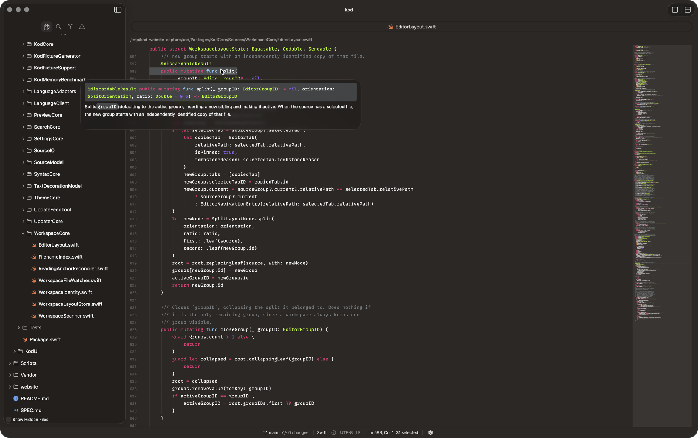

# Kod

Kod is a native, strictly read-only macOS code viewer built for speed, safety,
and focus. It provides offline syntax highlighting, plain-text search, Git
context, previews, and read-only language-server support without altering your
workspace or executing repository files.

* [Website & Downloads](https://kod.dev)
* [Releases](https://github.com/friggeri/kod/releases)



## Requirements

- macOS 14 or later (Apple Silicon only)

## Install

Download the latest notarized Apple Silicon DMG from
[GitHub Releases](https://github.com/friggeri/kod/releases), open it, and drag
Kod to Applications. Kod checks the signed release feed automatically and
always asks before downloading or installing an update.

## Trust & Privacy

Kod is designed with strict read-only guarantees:
- **No mutations**: Kod cannot edit, save, compile, or execute workspace files.
- **No telemetry**: Kod does not collect analytics or send code over the network.
- **Privacy**: Read [docs/privacy.md](docs/privacy.md) for full details on updates and privacy.
- **Security**: Read [SECURITY.md](SECURITY.md) for how to report vulnerabilities.

## Contribution & Agents

We welcome contributions! Please review our guidelines before submitting a PR or using automated agents:
- [CONTRIBUTING.md](CONTRIBUTING.md) — How to build, test, and submit changes.
- [AGENTS.md](AGENTS.md) — Safe commands and rules for automated tools working on this codebase.

## Build and test

- macOS 14+ and Xcode 26.5 (Swift 6.3) are required to build Kod.
- The application uses two local Swift packages (`Packages/KodCore`,
  `Packages/KodUI`) plus a pinned Sparkle 2.9.6 package for signed updates.
- Open `Kod.xcodeproj` and run the `Kod` scheme.

To verify changes, run the cumulative test script:

```sh
Scripts/verify
```

Set `KOD_RUN_SCALE_TESTS=1` to additionally run the 100,000-file discovery scale gate (skipped by default).

Language adapter integration tests require the pinned real servers listed in `Scripts/vendor-test-language-servers/manifest.json`.

## License

Kod is released under the [MIT License](LICENSE). Third-party notices and licenses are documented in [THIRD_PARTY_NOTICES.md](THIRD_PARTY_NOTICES.md).
