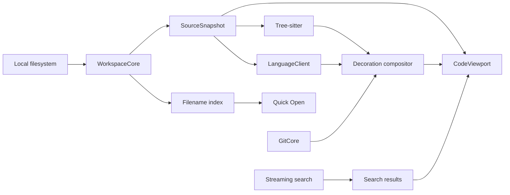

# Kod Product and Technical Specification

**Status:** Draft for implementation  
**Target:** Kod 1.0  
**Platform:** macOS 14 Sonoma and later  
**Architecture priority:** Apple silicon first; Intel best-effort  
**Last updated:** 2026-08-06

## 1. Product definition

Kod is a native macOS application for reading and understanding local codebases. It combines the speed and platform integration of a focused Mac app with the strongest code-viewing capabilities of VS Code: fast navigation, language intelligence, diagnostics, search, source control context, themes, and fonts.

Kod is not an editor. It must never offer an operation that changes source files or repository state.

### 1.1 Product promise

> Open a large local repository, find any file or symbol immediately, and move through the code with full language intelligence without risking an accidental edit.

### 1.2 Product principles

1. **Read-only by construction.** Source mutation is not merely disabled in the UI; editing commands and mutating protocol capabilities are absent from the product.
2. **First content fast.** File browsing and plain-text rendering must not wait for syntax parsing, Git, search indexing, or a language server.
3. **Progressive intelligence.** Tree-sitter highlighting, Git context, diagnostics, and semantic information may arrive incrementally without blocking interaction.
4. **Native where it matters.** Kod uses native windowing, input, accessibility, typography, scrolling, menus, and system appearance.
5. **Local and private.** Source remains on the Mac. Network access is limited to explicit app updates, user-approved remote preview resources, user-owned language-server behavior, and opt-in crash reports.
6. **Predictable over extensible.** Kod ships a curated, tested feature set. There is no extension runtime or arbitrary in-process plug-in API.

## 2. Goals and non-goals

### 2.1 Goals

- Open one local folder or Git repository per window.
- Remain responsive in repositories with 100,000 files and a 5 GB working tree.
- Fully view source files up to 10 MB under the performance contract in section 12.
- Provide keyboard-first file, text, symbol, and navigation-history workflows.
- Support quality-gated bundled Tree-sitter syntax for Swift, TypeScript, JavaScript, HTML, CSS, Python, Rust, shell, Markdown, JSON, YAML, TOML, C, Go, Java, Ruby, Lua, GraphQL, and XML, with Plain Text fallback.
- Support a complete read-only LSP surface: hover, definitions, declarations, type definitions, implementations, references, document symbols, workspace symbols, diagnostics, semantic tokens, inlay hints, call hierarchy, and type hierarchy.
- Provide editable global language profiles that discover or register user-installed language servers without downloading or installing them.
- Show Git status, working-tree and staged differences, inline change markers, a file diff view, and blame information without changing Git state.
- Support installed monospaced fonts and import both VS Code color-theme JSON files and Kod-native themes.
- Preview Markdown, images, JSON, and property lists.
- Meet native macOS accessibility, keyboard, appearance, and restoration expectations.

### 2.2 Non-goals for 1.0

- Editing, formatting, rename, refactoring, quick fixes, code actions, or applying workspace edits.
- Git commits, staging, checkout, branch switching, fetch, pull, push, or any other repository mutation.
- Remote repositories, SSH workspaces, containers, or cloud workspaces.
- Multi-root workspaces.
- An integrated terminal, debugger, test runner, task runner, REPL, or build system.
- Standalone linter integrations; diagnostics arrive through LSP only.
- An extension marketplace, extension host, arbitrary scripts, or VSIX installation.
- Full VS Code settings, keybinding, TextMate bundle, or workbench compatibility.
- Arbitrary Quick Look previews.
- Collaboration, accounts, synchronization, or source upload.

## 3. Target users and core jobs

### 3.1 Primary users

- Developers exploring a current or unfamiliar local codebase.
- Reviewers tracing behavior across files before or during review.
- Engineers monitoring diagnostics or implementation structure while another tool owns editing.
- Presenters and educators who want a clean, safe code-reading environment.

### 3.2 Core jobs

1. Open a repository and reach a known file or symbol with minimal latency.
2. Follow definitions, references, implementations, and call relationships while preserving navigation history.
3. Search a repository without waiting for a persistent content index.
4. Understand diagnostics and type information without changing the code.
5. Compare local changes with Git and identify authorship.
6. Read code using a preferred font and visual theme for long periods.

## 4. Product scope

### 4.1 Workspace model

- A window owns exactly one local folder or Git worktree.
- Multiple independent windows may be open.
- A window may contain multiple horizontal or vertical editor groups.
- Each group owns tabs, a selected tab, and independent back/forward navigation history.
- Window, group, tab, selection, fold, and scroll state are restored between launches.
- All Kod metadata is stored outside the workspace. Kod must not create `.kod`, cache, history, or settings files in a repository.

### 4.2 Supported launch languages

| Profile | Bundled syntax | Optional local server candidates |
| --- | --- | --- |
| Swift | Tree-sitter Swift | SourceKit-LSP via active Xcode/toolchain or selected path |
| TypeScript / JavaScript | Tree-sitter TypeScript/JavaScript | `typescript-language-server` |
| HTML / CSS | Tree-sitter HTML/CSS | VS Code HTML/CSS language servers |
| Python | Tree-sitter Python | Pyright-compatible server |
| Rust | Tree-sitter Rust | `rust-analyzer` via `rustup`, PATH, or selected path |
| Shell | Tree-sitter Bash | `bash-language-server`, with optional ShellCheck discovery |
| Markdown | Tree-sitter Markdown block + inline | Marksman |
| JSON / YAML / TOML | Corresponding Tree-sitter grammar | VS Code JSON server, `yaml-language-server`, Tombi, or Taplo |
| C / Go / Java | Corresponding Tree-sitter grammar | `clangd`, `gopls`, or `jdtls` |
| Ruby / Lua | Corresponding Tree-sitter grammar | `ruby-lsp` or `lua-language-server` |
| GraphQL / XML | Corresponding Tree-sitter grammar | `graphql-lsp` or `lemminx` |

Kod's LSP client must remain protocol-generic. "Supported" means the listed combination is tested, has a setup adapter, and receives release-blocking compatibility coverage; it does not mean the client hard-codes protocol behavior by language.

## 5. User experience specification

### 5.1 Window layout

A standard window contains:

1. **Toolbar:** sidebar toggle, back/forward, repository name, current relative path, global quick-open/search entry point, and LSP status.
2. **Sidebar:** mutually exclusive Explorer, Search, Source Control, Symbols, and Problems views.
3. **Content area:** one or more split groups containing tabs and a code or preview surface.
4. **Breadcrumb bar:** path and symbol ancestry for the active code view.
5. **Status bar:** language, encoding, line ending, cursor/selection location, Git branch as read-only context, and language-server state.

The sidebar and status bar may be hidden. Layout changes must not reparse source or restart language servers.

### 5.2 Opening a workspace

1. The user opens a folder through the standard macOS open panel, drag and drop, Open Recent, or Finder's Open With action.
2. Kod canonicalizes the root, detects a Git worktree, and checks workspace trust.
3. The window becomes usable immediately in syntax/search-only mode.
4. File discovery, quick-open indexing, Git status, and state restoration run concurrently.
5. The first time an untrusted workspace is opened, Kod shows a non-modal trust banner. A persistent status-bar indicator shows the current trust state thereafter and opens a confirmation prompt before allowing or revoking trust. No language server or repository-discovered executable starts before approval.
6. Once trusted, configured language servers start lazily when a matching source file is opened or a workspace-symbol operation requires one.

Opening a workspace must not automatically fetch network content.

### 5.3 File explorer and quick open

- The Explorer presents a lazily expanded tree, not 100,000 prebuilt row objects.
- Default exclusions follow Git ignore rules and Kod's global exclusions. Users can reveal ignored and hidden files.
- Symlinks are displayed but are not recursively indexed outside the root by default.
- Single-click opens a replaceable preview tab; double-click, a navigation jump, or explicit pinning makes the tab persistent.
- Quick Open searches the in-memory filename index using path-aware fuzzy matching.
- Ranking favors contiguous matches, basename matches, recently visited files, and shallower paths while remaining deterministic.
- Results stream as the query changes and retain selection when stable.

### 5.4 Code-viewer interactions

The code surface supports:

- Text selection, multi-line selection, Select All, Copy, Copy Path, and Copy Symbol Name.
- Scrolling, zooming, folding, sticky scope headers, line numbers, indentation guides, current-line emphasis, and optional minimap.
- Word wrap off by default and configurable globally or per window.
- Find in File with plain text, case, whole-word, and regular-expression modes.
- Go to Line, Go to Symbol, Go to Matching Bracket, and breadcrumb navigation.
- Command-click navigation, hover information, Peek Definition, Peek References, and result lists.
- Per-group Back and Forward with the exact file, selection, fold state, and scroll anchor.
- Horizontal and vertical splits with drag-and-drop tab movement.
- Automatic system light/dark switching when the selected theme supports both appearances.

The surface has no insertion caret and accepts no text-input operation. Printable keys may invoke commands or incremental search but never enter source text.

### 5.5 Strict read-only behavior

Kod must not expose or invoke:

- LSP rename, formatting, range formatting, on-type formatting, code action, code lens commands that execute actions, or `workspace/executeCommand`.
- LSP `workspace/applyEdit`, file create/rename/delete operations, or edits returned by any server request.
- Source save, autosave, overwrite, line-ending conversion, or encoding conversion.
- Git commands that alter the index, refs, working tree, remotes, configuration, or object database.
- Drag-and-drop operations that move repository files.

If a server sends a mutating request, Kod rejects it with the correct LSP error, records a local diagnostic event, and shows a non-blocking explanation when user action initiated the exchange.

Third-party language servers may access the network, invoke tools, or create caches and build artifacts after a workspace is trusted. The trust dialog must disclose that user-selected servers are not sandboxed and that Kod cannot technically prevent those side effects.

### 5.6 External file changes

- FSEvents detects file, directory, ignore-file, and Git metadata changes.
- Because Kod has no unsaved state, a changed open file reloads automatically into a new immutable snapshot.
- Reload preserves the selected logical line, nearest symbol, folds, and viewport anchor when possible.
- A deleted or moved open file remains visible as a tombstone tab until closed or relocated.
- Repeated write bursts are coalesced. Stale parsing, Git, search, and LSP responses are discarded by snapshot version.

### 5.7 Keyboard model

Kod follows native macOS conventions first and adds familiar VS Code navigation shortcuts where they do not conflict.

Required commands include:

- Command-P: Quick Open
- Command-Shift-P: Command Palette
- Command-F: Find in File
- Command-Shift-F: Search Workspace
- Command-Option-Left / Right: Navigate Back / Forward
- Command-Backslash: Split
- Command-W: Close Tab
- Command-Shift-O: Go to Symbol in File
- Control-G: Go to Line
- F12 and Command-click: Go to Definition

All commands must appear in menus so macOS users can discover and remap them in System Settings. A custom keybinding file is not part of 1.0.

## 6. Language intelligence

### 6.1 LSP feature surface

Kod implements and presents these read-only capabilities:

- Hover
- Definition, declaration, type definition, and implementation
- References
- Document highlight
- Document symbols and workspace symbols
- Publish and pull diagnostics
- Semantic tokens, including full, range, and delta updates
- Inlay hints
- Signature help when explicitly requested for the selected symbol
- Call hierarchy
- Type hierarchy
- Folding ranges
- Selection ranges
- Document links

Capabilities that imply mutation are not advertised during initialization. Dynamic registrations for mutating capabilities are rejected.

### 6.2 Server lifecycle

- One server process is shared per workspace, language adapter, and compatible configuration.
- Servers start lazily after trust and shut down gracefully when the last owning window closes.
- Communication uses stdio in 1.0. TCP and WebSocket transports are out of scope.
- Every request has a timeout policy, cancellation token, snapshot version, and visible progress behavior.
- Kod sends `$/cancelRequest` when navigation becomes obsolete.
- A crashed server restarts at most three times in five minutes. After that, Kod disables it for the workspace and presents logs and a manual Restart action.
- Server stderr is captured into bounded, rotating local logs with path and source-content redaction in exported diagnostics.
- The UI always distinguishes Starting, Indexing, Ready, Busy, Stopped, Missing, Crashed, and Disabled states.
- Syntax viewing and text search remain available when a server is missing, slow, or failed. The degraded state is explicit, not silent.

### 6.3 Document synchronization

- An opened source file becomes an immutable, versioned `SourceSnapshot`.
- Kod sends `textDocument/didOpen` after the snapshot is available and the matching server is initialized.
- External changes increment the document version and send `didChange`; Kod never originates a change from keyboard input.
- Closing the last view sends `didClose` after a short reuse grace period.
- Kod negotiates UTF-8 positions when supported and otherwise maintains a tested UTF-16 mapping.
- All returned ranges are validated against the snapshot version and bounds before display.

### 6.4 Diagnostics

- The Problems sidebar merges server diagnostics by workspace, file, severity, source, and code.
- Inline markers include gutter symbols, underlines, overview/minimap marks, and optional line annotations.
- Diagnostics can be filtered but not suppressed by mutating project configuration.
- Selecting a diagnostic navigates without changing the problem list.
- Quick fixes and code actions are intentionally absent, even when advertised by the server.

### 6.5 Language profiles and server discovery

Discovery order is deterministic:

1. Explicit Kod per-workspace override stored outside the repository.
2. The profile's explicitly selected absolute executable.
3. A migrated legacy global override, when present.
4. Ordered profile candidates using constrained discovery such as `xcrun`, `rustup`, PATH, or common package-manager locations.

Kod displays the selected executable, version, source, and arguments before first launch. It must never evaluate shell text or repository-provided command strings.

The Languages settings pane is the shared source of truth for syntax and server
status. It provides editable, disableable default profiles and global custom
profiles. Each profile maps files to a bundled grammar or Plain Text and may
optionally define an LSP language ID, a selected executable, and fixed arguments.
Kod validates that selected executables are absolute local executable paths,
launches argument arrays directly without a shell, and never executes package
manager commands.

Settings exposes Add/Edit Profile, Choose Executable, Use Auto-Detected,
Enable/Disable, Reset Default, and Delete Custom Profile. Association conflicts
require explicit confirmation; exact filenames take precedence over extensions,
then bounded built-in content matchers apply. A missing-server prompt offers
Choose Executable, Open Language Settings, Find a Server, and Not Now. The Find
action opens the public LSP implementors directory only after user action and
does not imply endorsement.

For a missing server on a default (non-custom) profile, Kod may additionally
show curated installation guidance from a separate, shipped-only catalog keyed
by default profile identifier (`DefaultLanguageServerInstallationGuides`) —
never part of the editable, Codable profile model, and never resolvable for a
custom profile even if it reuses a default profile's identifier or metadata.
The guidance is an exact, package-manager-labeled command (e.g. `npm`, `pnpm`,
Homebrew, `rustup`, `go install`, RubyGems, or the Xcode Command Line Tools)
shown as selectable monospaced text with a one-click "Copy ... Command" button,
plus a link to that server's official installation documentation. When a
known default profile with guidance is missing its server, the workspace
banner's Find action becomes "Installation Help..." and opens that
documentation directly instead of the generic directory; unknown file types,
custom profiles, and default profiles without guidance keep the public
directory fallback. Kod only displays and copies this text; it never executes
a package manager, shell command, update, or removal.

## 7. Syntax and visual presentation

### 7.1 Highlighting pipeline

Highlighting is layered in this order:

1. Plain foreground/background theme colors.
2. Tree-sitter lexical and structural captures.
3. LSP semantic-token overrides.
4. Search and symbol-reference highlights.
5. Diagnostics.
6. Selection and active navigation target.

Each layer is independently versioned and may update without rebuilding unrelated layers. The visible viewport receives priority over offscreen token decoration.

Tree-sitter grammars and queries are compiled into Kod releases. There is no runtime grammar-extension mechanism in 1.0.

### 7.2 Themes

Kod ships at least:

- One light theme.
- One dark theme.
- One high-contrast light theme.
- One high-contrast dark theme.

Users may import:

- A standalone VS Code color-theme JSON file.
- A versioned Kod theme JSON file.

Kod does not install VSIX packages. VS Code import supports `colors`, `tokenColors`, and `semanticTokenColors`. Unsupported keys are ignored with an import report rather than treated as success. Workbench colors map to the nearest Kod surface token through a documented mapping table.

The Kod-native format defines:

- Metadata and schema version.
- Light, dark, or high-contrast appearance.
- Window, sidebar, tab, breadcrumb, status, list, border, focus, and selection colors.
- Editor base colors.
- Tree-sitter capture colors and font traits.
- LSP semantic token type/modifier rules.
- Diagnostic and Git decoration colors.

Theme switching updates the visible UI immediately and invalidates offscreen render caches lazily.

### 7.3 Fonts

The font picker lists installed monospaced families and previews code before applying a choice. Settings include:

- Family
- Size
- Weight
- Ligatures
- Line-height multiplier
- Letter spacing
- Ordered Unicode fallback families

Kod must preserve column alignment for tabs, indentation guides, selections, diagnostics, and inline hints. If a chosen fallback is not monospaced, Kod warns that alignment may vary but continues to render safely.

## 8. Search

### 8.1 Filename index

- Workspace discovery builds a compact, in-memory relative-path index.
- The index contains path components, file type, ignore state, and recency metadata, not file contents.
- Initial results are available while discovery continues.
- FSEvents incrementally updates the index.
- Index memory must scale approximately linearly and remain within the budget in section 12.

### 8.2 Workspace text search

- Kod uses a bundled, version-pinned ripgrep-compatible engine.
- Search is on demand; there is no persistent content index.
- Results stream by file and line with match ranges.
- Search supports regular expressions, case, whole word, include globs, exclude globs, hidden files, and ignored files.
- Default behavior respects `.gitignore`, `.ignore`, global Git excludes where discoverable without executing helpers, and Kod exclusions.
- Every query is cancellable. Starting a new query terminates or supersedes the prior query.
- Result limits are explicit. Reaching a limit never appears as a complete search.
- Search subprocess output is parsed incrementally and bounded to prevent unbounded memory growth.

## 9. Git viewing

Git integration is read-only and optional for non-Git folders.

### 9.1 Features

- Repository root, current branch or detached HEAD, and worktree status.
- File status grouped by staged, unstaged, untracked, conflicted, ignored, and renamed.
- Explorer badges and inline added/modified/deleted gutter markers.
- File diff against HEAD, index, or working tree as applicable.
- Unified and side-by-side diff modes.
- Per-line blame with author, commit, timestamp, and summary.
- Commit metadata popover for a blamed line.

### 9.2 Safety

- Kod invokes an absolute Git executable with fixed argument arrays, never shell strings or aliases.
- Commands set `GIT_OPTIONAL_LOCKS=0`, disable external diff and text-conversion helpers, disable repository filesystem-monitor commands, and avoid hooks.
- No automatic fetch occurs.
- Git work is cancellable, runs outside the main thread, and is cached by HEAD/index/worktree identity.
- If a safe read-only invocation is not possible, Kod disables the affected feature and explains why.

## 10. Built-in previews

### 10.1 Markdown

- Source and rendered modes.
- CommonMark plus GitHub-style tables, task lists, and fenced code.
- Syntax highlighting in fenced code uses Kod's built-in Tree-sitter grammars.
- Raw HTML is sanitized; scripts never run.
- Remote images and other network resources are blocked by default and require an explicit per-document action.
- Links show their destination and require confirmation before opening non-local URLs from an untrusted workspace.

### 10.2 Images

- PNG, JPEG, GIF first frame or animation when resource-safe, HEIC, TIFF, and SVG rendered without scripts or external resources.
- Fit, actual size, zoom, pan, transparency background, and image metadata.
- Oversized/decompression-bomb safeguards with an explicit error state.

### 10.3 JSON and property lists

- Raw source and structured tree modes.
- Expand/collapse, copy value, copy key path, and search.
- Invalid data falls back to the source viewer with a parse diagnostic.
- Binary property lists are decoded into a read-only structured view.

## 11. Technical architecture

### 11.1 Platform choices

- Swift 6 with strict concurrency checking.
- macOS 14 SDK minimum.
- AppKit for windows, menus, commands, drag/drop, accessibility integration, scroll views, and the code-viewing surface.
- Core Text for source layout and drawing.
- SwiftUI selectively for settings, setup flows, and low-frequency inspector surfaces where it does not constrain performance.
- Tree-sitter C libraries behind typed Swift wrappers.
- Foundation `Process` for isolated language-server, search, and Git subprocesses.
- SQLite for small versioned metadata such as recent workspaces and restoration state; never for source-content indexing.

### 11.2 Major modules

| Module | Responsibility |
| --- | --- |
| `KodApp` | App lifecycle, commands, windows, restoration, updates |
| `WorkspaceCore` | Root identity, trust, file discovery, ignore rules, FSEvents |
| `SourceModel` | Immutable snapshots, decoding, line index, position mapping |
| `CodeViewport` | Virtualized layout, Core Text drawing, selection, folding, accessibility |
| `SyntaxCore` | Tree-sitter parsers, queries, captures, parse scheduling |
| `LanguageClient` | JSON-RPC, LSP state machine, capability filtering, cancellation |
| `LanguageAdapters` | Language profiles, routing, local executable discovery, and configuration |
| `SearchCore` | Filename fuzzy index, file find, streaming text search |
| `GitCore` | Safe read-only status, diff, blame, cache invalidation |
| `ThemeCore` | Native themes, VS Code import, resolved style tables |
| `PreviewCore` | Markdown, image, JSON, and plist previews |
| `SettingsCore` | Global and external per-workspace settings, migrations |
| `DiagnosticsCore` | Local logs, crash state, support bundle redaction |

Module boundaries must be testable without constructing a window or starting a real server.

### 11.3 Runtime data flow

The `SourceSnapshot` version is the consistency boundary. Parse results, semantic tokens, diagnostics, Git hunks, and navigation ranges are displayed only when compatible with the active snapshot.

### 11.4 Source model

Each immutable snapshot contains:

- Canonical file identity, size, modification metadata, and content digest when needed.
- Original byte storage, memory-mapped when safe.
- Detected encoding and line endings.
- A compact line-start index.
- Lazy decoded line slices.
- Byte, Unicode scalar, UTF-8 LSP, and UTF-16 LSP position conversion.

Encoding detection order is BOM, valid UTF-8, user-configured fallback, then binary/unsupported. UTF-8, UTF-16 LE/BE, UTF-32 LE/BE, LF, CRLF, and CR line endings are required. Decoding errors are visible and never silently replaced without an indicator.

### 11.5 Virtualized code renderer

`CodeViewport` is a custom read-only AppKit view hosted in `NSScrollView`.

- Only visible visual lines plus a small overscan region receive Core Text layout objects.
- Layout caches are keyed by snapshot, line, font metrics, theme traits, wrap width, and inline-hint version.
- No `NSTextStorage` copy of the entire file is required for display.
- Unwrapped mode uses the line-start index for constant-time vertical positioning.
- Wrapped mode computes visual-row counts lazily and maintains a prefix-sum structure for Y-to-line mapping.
- Initial paint uses plain text. Syntax and semantic decorations repaint affected visible ranges as they arrive.
- Selection is represented as source ranges, not mutable attributed strings.
- Accessibility exposes line-oriented text ranges, selections, rotor navigation for symbols and diagnostics, and stable screen-to-source mapping.

The renderer must correctly handle Unicode grapheme clusters, bidirectional text, combining marks, emoji, tabs, very long lines, variable fallback glyphs, and mixed line endings. A dedicated renderer spike is a release prerequisite, not post-launch optimization.

### 11.6 Concurrency and cancellation

- UI state and drawing are `@MainActor`.
- Each workspace has an actor that owns root state and snapshot generations.
- Each language-server connection has a dedicated actor and framed JSON-RPC transport.
- Parsing, file discovery, Git, decoding, search parsing, and diff computation run in bounded task pools.
- Work is prioritized: visible viewport, active tab, visible sidebar, other open tabs, then background workspace tasks.
- Closing a tab, changing a query, changing a snapshot, or closing a workspace cancels obsolete work.
- No unbounded `Task.detached`, result array, decoration list, process buffer, or log buffer is permitted.

### 11.7 Persistence

Kod stores the following under its Application Support container:

- Recent workspace identities and trust decisions.
- Window, split, tab, navigation, fold, and scroll restoration.
- Global and per-workspace settings.
- Imported themes.
- Global language profiles and selected local executable metadata.
- Bounded diagnostic logs.

Caches live under the system cache directory and may be deleted without data loss. Source contents, search indexes, and LSP responses are not persisted beyond what is required for restoration metadata.

## 12. Performance contract

### 12.1 Reference workloads

Release benchmarks run on:

- A baseline Apple-silicon Mac with 16 GB RAM and a local APFS SSD.
- The oldest supported macOS major version and the current macOS major version.
- A generated 100,000-file, 5 GB repository with representative nested paths.
- Representative 1 MB and 10 MB source files, plus adversarial Unicode and long-line fixtures.

Language-server time and memory are reported separately from Kod because third-party servers are outside Kod's direct performance control.

### 12.2 Budgets

Unless stated otherwise, targets are p95 across 30 measured runs on the reference machine.

| Operation | Target |
| --- | --- |
| Cold app launch to interactive empty window | <= 750 ms |
| Warm app launch to interactive empty window | <= 300 ms |
| Workspace open to browsable tree and partial Quick Open results, 100k files | <= 1.5 s |
| Complete filename discovery, 100k files | <= 3.0 s |
| Open 1 MB UTF-8 source to first plain-text viewport | <= 100 ms |
| Open 10 MB UTF-8 source to first plain-text viewport | <= 250 ms |
| Quick Open query update after discovery | <= 16 ms main-thread work |
| Find in File first result in a 10 MB file | <= 75 ms |
| Workspace search first result on a warm local SSD | <= 200 ms |
| Back/Forward restore of an already open location | <= 50 ms |
| Theme change to visible repaint | <= 100 ms |
| External file write to visible refreshed snapshot | <= 500 ms after write burst settles |
| Main-thread stall after initial window display | No task > 50 ms |
| Scrolling at 60 Hz | p95 frame <= 16.7 ms; p99 <= 33 ms |
| Kod resident memory, 100k-file workspace with one 10 MB file open | <= 350 MB, excluding LSP/search/Git child processes |

At 120 Hz, Kod should render within 8.3 ms when hardware and content permit; 60 Hz correctness is the 1.0 release gate.

### 12.3 Large and pathological files

- Files through 10 MB receive normal viewing, search, syntax, and eligible LSP behavior.
- First paint never waits for a full-file Tree-sitter parse or LSP response.
- A source line longer than 100 KB, excessive nesting, invalid encoding, or parser resource limit may trigger an explicit safety mode.
- Safety mode preserves byte-safe viewing, selection, copy, line navigation, and text search while disabling or bounding wrapping, syntax, minimap, inlay hints, and LSP synchronization.
- Files above 10 MB may enter safety mode automatically. Kod must explain which features are limited and why.
- No supported or adversarial input may cause unbounded allocation, an uncancellable task, or a crash.

## 13. Security, trust, and privacy

### 13.1 Workspace trust

Untrusted workspaces may use:

- File browsing
- Plain-text and Tree-sitter viewing
- Filename and text search
- Built-in data previews
- Safe read-only Git inspection

They may not start:

- Language servers
- Repository-discovered executables
- Toolchain commands that inspect project configuration
- Remote Markdown resources
- Remote JSON, YAML, or TOML schemas requested by a language server

Trust is recorded against canonical path and volume identity, is visible in the status bar, and can be revoked from that indicator after confirmation.

### 13.2 Process security

- Subprocesses use absolute executable paths and argument arrays.
- Kod never passes repository content through a shell.
- Environment variables are allowlisted per adapter where practical.
- Process stdout, stderr, message size, execution time, and restart rates are bounded.
- JSON-RPC messages and all server ranges are schema- and bounds-validated.
- Profile-selected executables must be absolute, local, executable files; launch arguments remain discrete values and never pass through a shell.
- Custom profiles cannot provide arbitrary environment variables, shell commands, initialization payloads, or native parser plug-ins.

### 13.3 Privacy

- No source, path, symbol, diagnostic, theme, font, search, or repository data leaves the Mac by default.
- Kod collects no usage telemetry.
- Crash reporting is opt-in.
- Crash reports and support bundles redact source text, search terms, usernames, home-directory prefixes, repository remotes, environment secrets, and full paths by default.
- Network activity is attributable in the UI to app updates, trusted user-owned
  language-server behavior, remote Markdown resources, or crash reports.

## 14. Accessibility and localization

- Full keyboard access is required for every control and navigation result.
- VoiceOver exposes sidebar structure, tabs, breadcrumbs, code lines, selection, diagnostics, folds, diff markers, and navigation targets.
- The code view provides accessibility rotors for headings/symbols, diagnostics, references, and Git changes.
- Text zoom must reach at least 300 percent without clipping controls.
- Themes are checked for configurable contrast; bundled high-contrast themes meet WCAG AA for normal text.
- Reduce Motion, Increase Contrast, Differentiate Without Color, and system accent behavior are respected.
- No status is communicated by color alone.
- User-facing strings are localized through string catalogs from the first release, even if 1.0 initially ships in English.

## 15. Reliability and error behavior

- Every background subsystem has an explicit state and user-visible failure path.
- An unreadable file shows the filesystem error and Retry/Reveal actions.
- Invalid theme imports list rejected fields and preserve the current theme.
- Search cancellation and result truncation are visible.
- Unsupported encodings and binary detection are visible.
- A language-server failure never prevents source display.
- A Tree-sitter failure falls back to plain text and records a bounded diagnostic.
- Restoration skips missing roots or files without blocking other windows.
- Corrupt Kod metadata is quarantined and rebuilt; repository contents are never used as recovery storage.

## 16. Validation strategy

### 16.1 Automated coverage

- Unit tests for path identity, ignore rules, encoding, line indexing, byte/UTF-8/UTF-16 mapping, range validation, theme precedence, and Git parsing.
- Property and fuzz tests for Unicode positions, malformed LSP frames, hostile theme JSON, archive extraction, diff parsing, and renderer range math.
- Golden tests for Tree-sitter captures, semantic-token precedence, themes, diffs, Markdown sanitization, and structured previews.
- Recorded LSP transcript tests for every launch language and every advertised capability.
- Integration tests with pinned supported language-server versions.
- UI tests for opening, splitting, navigation history, search, diagnostics, restoration, trust, and VoiceOver labels.
- Performance tests for every budget in section 12, checked for regressions in CI on stable hardware.
- Filesystem tests that snapshot a fixture repository before and after Kod workflows and require byte-for-byte repository equality.

### 16.2 1.0 acceptance criteria

Kod 1.0 is releasable only when all of the following are true:

1. A 100,000-file reference repository opens within the stated time and memory budgets.
2. A 10 MB source file paints, scrolls, searches, selects, copies, and navigates without blocking the main thread or crashing.
3. All listed Tree-sitter languages pass syntax golden tests.
4. All listed language servers pass hover, navigation, references, symbols, diagnostics, semantic tokens, inlay hints, and hierarchy integration tests where the server supports them.
5. Missing, slow, malformed, and crashing servers degrade explicitly while code viewing remains usable.
6. A full automated user journey produces no change anywhere under the workspace root or in Git state.
7. Quick Open and workspace search stream deterministic, cancellable results at the target scale.
8. Git status, diff, inline markers, and blame agree with Git fixtures and execute no helper, hook, fetch, lock, or write.
9. VS Code theme JSON import, Kod-native themes, installed fonts, fallback fonts, and appearance switching work without restarting.
10. Split groups restore their tabs, history, selections, folds, and scroll anchors.
11. Markdown, image, JSON, and plist previews pass hostile-input and network-blocking tests.
12. Untrusted workspaces start no language server or repository-discovered executable.
13. VoiceOver and full keyboard navigation can complete the primary open-search-navigate-diagnose workflow.
14. The signed and notarized Apple-silicon build passes Gatekeeper on a clean Mac; Intel behavior is documented and tested on available hardware.
15. Opt-in crash reports contain none of the redacted source or identity fields in the privacy test suite.

## 17. Delivery milestones

Milestones are gated by exit criteria rather than dates.

### M0: Architecture and performance spikes

- Prove Core Text virtualization on the 10 MB and Unicode fixtures.
- Prove 100,000-file discovery and fuzzy filename indexing.
- Prove one end-to-end Tree-sitter and LSP path with snapshot versioning.
- Prove repository immutability checks and workspace trust.

**Exit:** The highest-risk architecture meets first-paint, scrolling, memory, accessibility-prototype, and no-write requirements.

### M1: Native viewer foundation

- Window, tabs, split groups, restoration, Explorer, Quick Open.
- Source snapshots, decoding, renderer, selection, copy, find, folding.
- Tree-sitter highlighting for all launch languages.
- Theme and font foundations.

**Exit:** Kod is a fast, stable syntax-aware viewer with no LSP dependency.

### M2: Search and language intelligence

- Streaming workspace search.
- Language client, editable profiles, local executable discovery, and trust gate.
- Full read-only LSP feature surface and Problems/Symbols views.
- Server failure, cancellation, logging, and recovery UX.

**Exit:** Every launch language passes the pinned LSP compatibility suite.

### M3: Git, previews, and customization

- Status, inline diff, diff views, and blame.
- Markdown, image, JSON, and plist previews.
- VS Code theme import, native theme format, complete font controls.
- Accessibility rotors and high-contrast polish.

**Exit:** All product-scope features are complete and repository immutability remains proven.

### M4: Scale and release hardening

- Performance regression suite and optimization.
- Hostile-input, fuzz, crash-recovery, migration, and privacy validation.
- Signed/notarized distribution, updater, diagnostics export, and release documentation.
- Apple-silicon release qualification and Intel best-effort compatibility report.

**Exit:** Every acceptance criterion in section 16.2 passes.

## 18. Deferred opportunities

The following require a separate post-1.0 product decision:

- Repository and commit history browsing beyond per-file blame.
- Multi-root workspaces.
- Additional quality-gated bundled grammars and default language profiles.
- Custom keybinding profiles.
- Remote repositories and hosted review integrations.
- A reduced Mac App Store edition.
- Additional safe structured previews.

None of these may weaken Kod's read-only contract or delay first content for the 1.0 scope.

## 19. Decision record

This specification incorporates these product decisions:

- Local folders and Git repositories only.
- One root per window, multiple windows, tabs, and horizontal/vertical split groups.
- Strictly no source or Git mutation.
- AppKit/Core Text rendering with selective SwiftUI.
- Tree-sitter syntax plus LSP semantic-token overlays.
- Full read-only LSP features.
- Editable profiles plus selected-path and known-candidate discovery for user-installed servers; Kod never installs language servers, and only ever shows curated, copyable installation commands and official documentation links for default profiles, never executing them.
- First-class bundled syntax for the supported profile catalog, with Plain Text fallback.
- In-memory filename indexing and on-demand ripgrep-compatible text search.
- Git status, inline changes, file diffs, and blame.
- VS Code color-theme JSON import plus a native Kod theme format.
- Installed monospaced fonts with typography and fallback controls.
- Code/text, Markdown, image, JSON, and plist viewing.
- macOS 14+, Apple silicon first, Intel best-effort.
- Direct signed/notarized distribution with an optional Homebrew Cask.
- Workspace trust before language servers or repository-discovered tools.
- LSP diagnostics only.
- Native macOS keyboard conventions with non-conflicting VS Code navigation shortcuts.
- No usage telemetry and opt-in, redacted crash reports.
